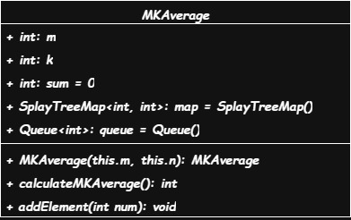
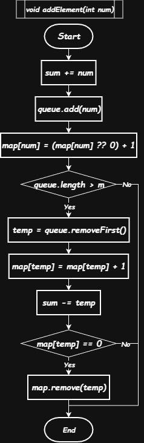
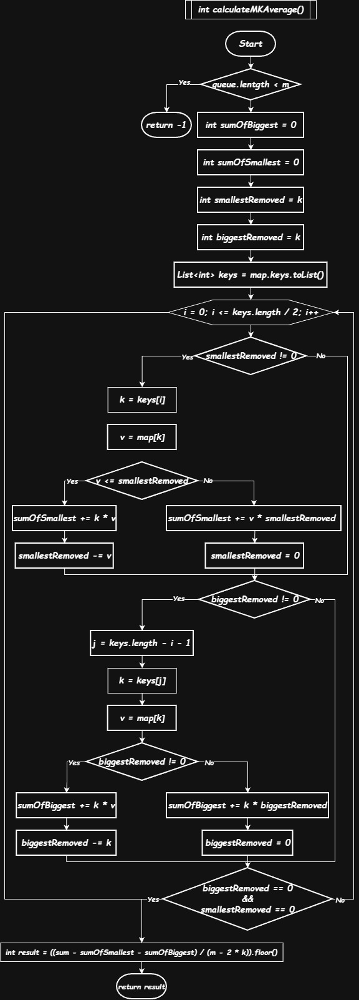

# 1825. Finding MK Average

**Difficulty:** Hard  
**Language:** Dart  
**Performance:** Runtime 177ms (Beats 100%), Memory 236.56 MB (Beats 100%)

This was problem #1000. A quiet milestone in the journey.

---

## The Problem

You're given a stream of numbers. At any moment, you need to answer: what's the average of the "middle" values from the last m numbers—after throwing away the k smallest and k largest?

The stream never stops. Numbers keep arriving. The window keeps sliding. You need answers fast.

**Interface:**

```dart
MKAverage(int m, int k)      // Setup: window size, removal count
void addElement(int num)      // New number arrives
int calculateMKAverage()      // What's the average? (or -1 if not ready)
```

**Example:**

```
m=3, k=1
Stream: [3, 1, 10]

Last 3 elements: [3, 1, 10]
Sorted: [1, 3, 10]
Remove 1 smallest (1), remove 1 largest (10)
Middle elements: [3]
Average: 3
```

**Constraints:**

- 3 ≤ m ≤ 10^5 (window can be huge)
- 1 ≤ k\*2 < m (must leave middle elements)
- 1 ≤ num ≤ 10^5 (reasonable value range)
- Up to 10^5 operations total (need to be fast)

---

## Why It's Tricky

The naive approach—sorting on every query—costs O(m log m). With 100,000 queries, that's too slow. You'd be sorting the same window over and over, recalculating everything each time.

The real challenge: as the window slides forward, one number leaves and one enters. Almost everything stays the same. You shouldn't need to rebuild from scratch.

You need structures that stay sorted as data flows in and out. Structures that update incrementally, not from zero each time.

---

## The Approach

Three structures working together, each doing one job well:

```dart
Queue<int> queue              // Remembers order: who arrived first?
SplayTreeMap<int, int> map    // value → count, always sorted
int sum                       // Running total, always current
```

**Why these?**

The **queue** knows what to remove when the window slides. First in, first out. It's the memory of time—without it, you wouldn't know which element is oldest.

The **map** stays sorted automatically and handles duplicates cleanly. In Dart, SplayTreeMap is a self-balancing binary search tree. Every insert, delete, or lookup costs O(log m). The keys are always in order—no sorting step needed.

The **sum** updates incrementally—no recalculation needed. Add when elements enter. Subtract when they leave. Always accurate in O(1) time.

### How They Sync

When these three structures work together, something elegant happens. They stay synchronized naturally:

```
Stream: [5, 2, 8, 2, 3] with m=5

After 5 additions:
Queue:  [5, 2, 8, 2, 3]         ← insertion order
Map:    {2:2, 3:1, 5:1, 8:1}    ← sorted, with counts
Sum:    20                       ← 5+2+8+2+3

When element #6 arrives (say, 6):
1. Add 6: queue=[5,2,8,2,3,6], map adds 6:1, sum=26
2. Window exceeded (6 > 5)
3. Remove oldest (5): queue=[2,8,2,3,6]
4. Update map: 5:1 becomes 5:0, remove it
5. Update sum: 26-5=21
Result: queue=[2,8,2,3,6], map={2:2,3:1,6:1,8:1}, sum=21
```

The structures never disagree. If the queue has 5 elements, the map's counts sum to 5, and the sum equals their total. This invariant holds always.

---

## Key Ideas

### Two-Pointer Sweep

When you need k smallest and k largest, you don't need to check every value. Start from both ends simultaneously:

```dart
for (var i = 0; i <= keys.length ~/ 2; i++) {
    // Process k smallest from left
    if (smallestRemoved > 0) { /* accumulate from small end */ }

    // Process k largest from right
    if (biggestRemoved > 0) { /* accumulate from large end */ }

    // Both done? Exit early
    if (smallestRemoved == 0 && biggestRemoved == 0) break;
}
```

This optimization matters more than you'd think. When duplicates exist, you might need only a few iterations to get all k values from each side. In practice, with real-world data that has repeated values, this averages O(k) instead of O(m).

Example: If k=100 and the first value appears 100 times, you're done in one iteration. No need to scan further.

### Partial Counts

This is the subtle part. Sometimes a value straddles the boundary between "remove" and "keep."

Say you need 5 smallest values. You've removed 3 so far. The next value appears 4 times. Should you take all 4? No—you only need 2 more to reach 5 total.

```dart
if (map[keys[i]]! <= smallestRemoved) {
    // Take all occurrences of this value
    sumOfSmallest += keys[i] * map[keys[i]]!;
    smallestRemoved -= map[keys[i]]!;
} else {
    // Take only what's needed (partial)
    sumOfSmallest += keys[i] * smallestRemoved;
    smallestRemoved = 0;  // Done
}
```

Without this logic, you'd either skip the value entirely (wrong) or take all of it (also wrong). The partial count ensures you remove exactly k elements, no more, no less.

**Visual example:**

```
k=5, map keys and counts:
{3:3, 5:4, 7:10, 9:2}

Process:
Step 1: key=3, count=3
        Need 5, take all 3 → sum += 3×3 = 9
        Removed: 3, need 2 more

Step 2: key=5, count=4
        Need 2, but there are 4 available
        Take only 2 → sum += 5×2 = 10
        Removed: 2, done (total removed: 5)

Result: sumOfSmallest = 19
Actually removed: [3,3,3,5,5] ← exactly 5 values
```

This precision is what makes the algorithm correct.

### Incremental Sum

The sum never needs recalculation. It's always one step behind reality:

```dart
void addElement(int num) {
    sum += num;                    // Add new number
    queue.add(num);
    map[num] = (map[num] ?? 0) + 1;

    if (queue.length > m) {
        int old = queue.removeFirst();
        map[old] = map[old]! - 1;
        if (map[old] == 0) map.remove(old);
        sum -= old;                // Subtract removed number
    }
}
```

The sum reflects exactly what's in the window. When you query it during `calculateMKAverage()`, it's already accurate. No loops, no accumulation, just read the variable.

This is the power of invariants: maintain them carefully during updates, and queries become trivial.

### Why Iterative Matters

The solution uses no recursion. Everything is loops and direct operations. This matters for production code:

- **No stack overflow risk** - Even with m=100,000, you're safe
- **Easier to debug** - Step through with a debugger, see every state
- **Predictable performance** - No hidden recursive overhead
- **Easier to optimize** - Modern CPUs handle tight loops well

Recursive solutions are elegant on paper. Iterative solutions ship to production.

---

## Visual Flow

### Class Structure



Five fields capture all state. Two methods modify or query. No hidden state, no complex initialization. Everything you need to understand the system is visible.

The `final` keywords on m and k signal that these never change—they're part of the system's identity. The mutable fields (sum, map, queue) evolve together as data flows.

### addElement() Flow



The flow is linear: add everywhere, then check if cleanup is needed. The synchronized update pattern ensures consistency:

1. **Add first** - New element enters all structures
2. **Check overflow** - Is the window too large?
3. **Remove oldest** - If yes, remove from all structures
4. **Cleanup** - Remove map entries that hit zero

Notice the symmetry: what you add to all three, you remove from all three. The structures move together, never drift apart.

**Complexity:** O(log m) because SplayTreeMap insert/delete dominates. The queue and sum updates are O(1), but the map operation sets the overall cost.

### calculateMKAverage() Flow



The calculation phase is read-only. Nothing changes. You're taking a snapshot of the current state and computing a value from it.

The two-pointer sweep is the heart of the algorithm: start from both ends of the sorted keys, accumulate until you've collected k from each side, stop early if possible.

**Complexity:** O(k) average case when duplicates allow early exit, O(m) worst case when all values are unique and you must check every key.

---

## Solution

```dart
import 'dart:collection';

class MKAverage {
  final int m;  // Window size - never changes
  final int k;  // Remove count per side - never changes
  int sum = 0;  // Running total of window - always current

  // Map: value → count of occurrences
  // SplayTreeMap keeps keys sorted automatically
  SplayTreeMap<int, int> map = SplayTreeMap();

  // Queue: remembers insertion order for FIFO removal
  Queue<int> queue = Queue();

  MKAverage(this.m, this.k);

  void addElement(int num) {
    // Add to all three structures
    sum += num;
    queue.add(num);
    map[num] = (map[num] ?? 0) + 1;  // ?? means "if null, use 0"

    // Slide window if it grew too large
    if (queue.length > m) {
      int temp = queue.removeFirst();  // Oldest element
      map[temp] = map[temp]! - 1;      // Decrease count
      if (map[temp] == 0) map.remove(temp);  // Clean up zeros
      sum -= temp;
    }
  }

  int calculateMKAverage() {
    // Not enough data yet
    if (queue.length < m) return -1;

    int sumOfSmallest = 0;
    int sumOfBiggest = 0;
    int smallestRemoved = k;  // How many more we need from left
    int biggestRemoved = k;   // How many more we need from right

    List<int> keys = map.keys.toList();  // Already sorted!

    // Two-pointer: process both ends simultaneously
    for (var i = 0; i <= keys.length ~/ 2; i++) {

      // Process from LEFT (smallest values)
      if (smallestRemoved != 0) {
        if (map[keys[i]]! <= smallestRemoved) {
          // Take ALL occurrences of this value
          smallestRemoved -= map[keys[i]]!;
          sumOfSmallest += keys[i] * map[keys[i]]!;
        } else {
          // Take only PART of this value (partial count)
          sumOfSmallest += keys[i] * smallestRemoved;
          smallestRemoved = 0;
        }
      }

      // Process from RIGHT (largest values)
      if (biggestRemoved != 0) {
        int rightIdx = keys.length - 1 - i;
        if (map[keys[rightIdx]]! <= biggestRemoved) {
          // Take ALL occurrences
          biggestRemoved -= map[keys[rightIdx]]!;
          sumOfBiggest += keys[rightIdx] * map[keys[rightIdx]]!;
        } else {
          // Take only PART (partial count)
          sumOfBiggest += keys[rightIdx] * biggestRemoved;
          biggestRemoved = 0;
        }
      }

      // Both sides done? Exit early
      if (smallestRemoved == 0 && biggestRemoved == 0) break;
    }

    // Middle sum = total - removed extremes
    // Middle count = total elements - removed elements
    return ((sum - sumOfSmallest - sumOfBiggest) / (m - 2 * k)).floor();
  }
}
```

---

## Complexity

| Operation              | Time                   | Space | Notes                         |
| ---------------------- | ---------------------- | ----- | ----------------------------- |
| `addElement()`         | O(log m)               | O(1)  | SplayTreeMap insert dominates |
| `calculateMKAverage()` | O(k) avg<br>O(m) worst | O(m)  | Keys list created each call   |
| Overall                | -                      | O(m)  | Queue + map store window      |

**Why O(log m) for addElement?**  
The queue operations are O(1). The sum update is O(1). But SplayTreeMap, being a balanced tree, takes O(log m) to insert or delete while maintaining sort order. That's the bottleneck.

**Why O(k) average for calculate?**  
If values have duplicates, you might collect all k elements from each side in just a few iterations. With uniform random data, you'd hit O(m). But real-world data often has patterns, making the average case closer to O(k).

**Space complexity:**  
The queue stores m elements. The map stores at most m distinct values (worst case: all unique). Constants like sum, m, k are O(1). Total: O(m).

---

## Walk-Through

### Example 1: Basic Flow

Let's trace through a complete example step by step:

```dart
MKAverage mkAvg = MKAverage(5, 1);  // Window of 5, remove 1 from each end

// State: queue=[], map={}, sum=0

mkAvg.addElement(3);
// queue=[3], map={3:1}, sum=3

mkAvg.addElement(1);
// queue=[3,1], map={1:1, 3:1}, sum=4

mkAvg.addElement(10);
// queue=[3,1,10], map={1:1, 3:1, 10:1}, sum=14

mkAvg.addElement(5);
// queue=[3,1,10,5], map={1:1, 3:1, 5:1, 10:1}, sum=19

mkAvg.addElement(5);
// queue=[3,1,10,5,5], map={1:1, 3:1, 5:2, 10:1}, sum=24
// Note: 5 appears twice, so its count is 2

// Now calculate:
mkAvg.calculateMKAverage();

// Step 1: Check size
queue.length = 5 = m ✓ (proceed)

// Step 2: Get sorted keys
keys = [1, 3, 5, 10]  // Note: 5 appears once in keys, but count is 2

// Step 3: Two-pointer iteration (k=1)
// Need: 1 smallest, 1 largest

i=0:
  Left (smallest):
    key=1, count=1
    1 <= 1? Yes, take all
    sumOfSmallest = 1×1 = 1
    smallestRemoved = 0 (done)

  Right (largest):
    key=10, count=1
    1 <= 1? Yes, take all
    sumOfBiggest = 10×1 = 10
    biggestRemoved = 0 (done)

  Both done, break!

// Step 4: Calculate middle average
middleSum = sum - sumOfSmallest - sumOfBiggest
         = 24 - 1 - 10
         = 13

middleCount = m - 2×k
            = 5 - 2×1
            = 3

average = 13 / 3 = 4.333... → 4 (floor)
```

The three middle values are actually [3, 5, 5]. Their sum is 13. Average is 4.33, floored to 4.

### Example 2: Two-Pointer Deep Dive

Here's how the two-pointer optimization actually saves work:

```dart
m=7, k=2
Current window sorted: [1, 3, 5, 7, 9, 11, 13]
All counts = 1 (no duplicates)

Goal: Remove 2 smallest, 2 largest

Iteration i=0:
  Left pointer → key[0] = 1
    count=1, need 2 more after this
    sumOfSmallest += 1×1 = 1
    smallestRemoved = 2-1 = 1

  Right pointer → key[6] = 13
    count=1, need 2 more after this
    sumOfBiggest += 13×1 = 13
    biggestRemoved = 2-1 = 1

Iteration i=1:
  Left pointer → key[1] = 3
    count=1, need 1 more after this
    sumOfSmallest += 3×1 = 4 (total)
    smallestRemoved = 1-1 = 0 ✓

  Right pointer → key[5] = 11
    count=1, need 1 more after this
    sumOfBiggest += 11×1 = 24 (total)
    biggestRemoved = 1-1 = 0 ✓

  Both counters at zero → BREAK

Result after just 2 iterations:
- sumOfSmallest = 4 (removed [1,3])
- sumOfBiggest = 24 (removed [11,13])
- Middle sum = total - 4 - 24
- Average = middleSum / (7-4) = middleSum / 3
```

We only checked 4 out of 7 values. The middle three [5, 7, 9] were never touched. That's the power of two-pointer.

### Example 3: Partial Counts (The Tricky Case)

This is where the algorithm's precision shows:

```dart
k=5 (need 5 smallest values)
Current map: {3:3, 5:4, 7:10, 9:2}

Iteration i=0:
  key=3, count=3

  Question: Is count(3) <= smallestRemoved?
  Is 3 <= 5? YES

  Action: Take ALL 3 occurrences
  sumOfSmallest += 3 × 3 = 9
  smallestRemoved = 5 - 3 = 2

  Status: Collected 3 values, need 2 more

Iteration i=1:
  key=5, count=4

  Question: Is count(4) <= smallestRemoved?
  Is 4 <= 2? NO

  Action: Take PARTIAL (only 2 out of 4)
  sumOfSmallest += 5 × 2 = 10
  smallestRemoved = 0

  Status: Collected 5 values total, DONE

Final result:
- sumOfSmallest = 9 + 10 = 19
- Values removed: [3, 3, 3, 5, 5] ← exactly 5 values
- Remaining 5s: [5, 5] stay in the middle calculation
```

Without partial count logic, you'd face a choice:

- Skip value 5 entirely → remove only 3 values (wrong)
- Take all 4 of value 5 → remove 7 values (wrong)

The partial count ensures exactly k values removed, every time.

---

## Why This Works

**SplayTreeMap** is the hidden hero. It's a self-balancing binary search tree that keeps keys sorted. In other languages, you might use TreeMap (Java), std::map (C++), or SortedDict (Python). Dart's version handles duplicates through counts—you map each value to how many times it appears.

The alternative would be maintaining a sorted list, but insertion/deletion in a list costs O(m). The tree keeps you at O(log m).

**Two-pointer** optimization exits early when both sides finish. This matters with duplicate-heavy data. Imagine k=1000 and the smallest value appears 1000 times. You're done in one iteration instead of scanning hundreds of keys.

**Running sum** avoids recalculation. Classic space-time tradeoff: spend O(1) space to save O(m) time on every query.

**Iterative** means no recursion. Stack-safe, predictable, debuggable. You can trace every step. You can add logging. You can optimize the loop. Recursion is beautiful but rigid. Iteration is practical.

---

## Alternatives Considered

**Three heaps (min-heap, max-heap, middle):**  
The idea: keep k smallest in a max-heap, k largest in a min-heap, everything else in the middle. When the window slides, rebalance between heaps.

The problem: rebalancing is complex. When you remove an element, you might need to move elements between all three heaps. Implementation is error-prone. Debugging is hard. The code becomes fragile.

**Sort every time:**  
The simplest approach. When `calculateMKAverage()` is called, sort the current window, grab the middle elements.

```dart
int calculateMKAverage() {
    if (queue.length < m) return -1;
    List<int> sorted = List.from(queue)..sort();
    int sum = 0;
    for (int i = k; i < m - k; i++) {
        sum += sorted[i];
    }
    return sum ~/ (m - 2*k);
}
```

The cost: O(m log m) per query. With 100,000 queries, that's catastrophic. You're doing unnecessary work—most of the window stays the same between queries.

**SplayTreeMap (our choice):**  
Already sorted. O(log m) to add or remove. Natural duplicate handling with counts. The sweet spot between complexity and performance.

The tradeoff: slightly more memory than an array (tree nodes have pointers). But memory is cheap. Time is not.

---

## What I Learned

**Data structures should do the work, not the algorithm.** When you pick the right structure, the code almost writes itself. The SplayTreeMap handles sorting. The queue handles order. The sum handles totals. Your job is just to keep them synchronized.

**Two-pointer patterns appear everywhere once you start looking.** Whenever you need extremes from both ends of a sorted collection, think two-pointer. It's a pattern that generalizes.

**Dart's `??` operator and SplayTreeMap make this cleaner than it would be in many languages.** The null-coalescing operator handles the "initialize or increment" pattern elegantly. The built-in balanced tree means no manual balancing code.

**Iterative solutions age better than recursive ones.** When you come back to this code in six months, you'll understand it immediately. When you need to add logging, you'll know where. When performance matters, you'll see the hotspots clearly.

**Partial counts are easy to miss.** In the first attempt, I got this wrong. The boundary case where a value straddles the k-th position is subtle. Test thoroughly with duplicates.

**Sometimes the quiet solutions are the best ones.** No clever tricks. No academic algorithms. Just three structures doing their jobs, synchronized carefully. That's what scales.

---

_Solved November 20, 2024_  
_Problem #1000_  
_Day 253 of the streak_

[← Featured](../../featured/README.md) | [LeetCode](https://leetcode.com/problems/finding-mk-average/)
