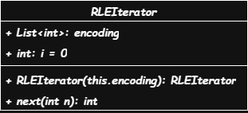
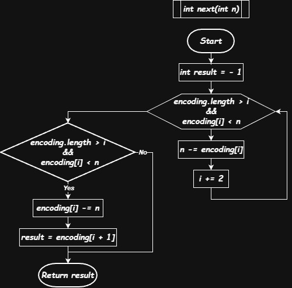

# 900. RLE Iterator

**Difficulty:** Medium  
**Language:** Dart  
**LeetCode:** [Problem Link](https://leetcode.com/problems/rle-iterator/)

---

## Problem Statement

Design an iterator that iterates through a **run-length encoded** sequence.

**Run-Length Encoding (RLE)** compresses sequences by storing value-count pairs:

- Array format: `[count₁, value₁, count₂, value₂, ...]`
- Even indices hold counts
- Odd indices hold the actual values

**Example encoding:**

```
Original sequence: [8, 8, 8, 5, 5]
RLE encoding: [3, 8, 2, 5]
Meaning: "three 8s, two 5s"
```

**Interface:**

```dart
RLEIterator(List<int> encoding)  // Initialize with encoded array
int next(int n)                   // Exhaust n elements, return last one
```

The `next(n)` method:

- Consumes the next n elements from the sequence
- Returns the last element consumed
- Returns -1 if fewer than n elements remain

**Example:**

```
Input:
RLEIterator([3, 8, 0, 9, 2, 5])  // Represents [8, 8, 8, 5, 5]

next(2)  →  8   // Consume [8, 8], return last = 8
             // Remaining: [8, 5, 5]

next(1)  →  8   // Consume [8], return 8
             // Remaining: [5, 5]

next(1)  →  5   // Consume [5], return 5
             // Remaining: [5]

next(2)  → -1   // Need 2, only 1 available
             // Return -1 (not enough elements)
```

**Constraints:**

- 0 ≤ encoding.length ≤ 1000
- encoding.length is even
- 0 ≤ encoding[i] ≤ 10^9
- At most 1000 calls to next()
- 1 ≤ n ≤ 10^9 for each next() call

---

## Approach

### The Challenge

The naive approach would be to **decode the entire sequence upfront**, storing all values in an array. But with counts up to 10^9, this could require billions of elements in memory—impossible.

**Key insight:** We don't need to store the full sequence. We just need to track:

1. Current position in the encoding array
2. How many elements we've consumed from the current run

### The Solution: Track Position and Consumption

Maintain two pointers:

- `i` - Current index in encoding array (always even)
- Track remaining count in current run by modifying encoding[i] directly

**Algorithm for next(n):**

1. **Skip exhausted runs** - While current run has fewer than n elements:

   - Subtract current run's count from n
   - Move to next run (i += 2)

2. **Consume from current run** - If current run has enough elements:

   - Subtract n from current run's count
   - Return the value (encoding[i + 1])

3. **Handle insufficient elements** - If we run out of runs:
   - Return -1

### Why This Works

Instead of storing billions of 8s, we just store `[3, 8]` and remember "we've used 2 of these 3 eights."

When next(n) is called:

- If n ≤ remaining count in current run → consume from it
- If n > remaining count → skip this run, move to next

**Space efficiency:** O(encoding.length) instead of O(sum of all counts)

---

## Visual Flow

### Class Structure



Two fields maintain all state:

- `encoding` - The RLE array (modified in-place)
- `i` - Current position (always points to a count)

### next(n) Flow



The algorithm has two phases:

**Phase 1: Skip insufficient runs**

- While current run can't satisfy n, skip it
- Reduce n by the skipped run's count

**Phase 2: Consume from sufficient run**

- Subtract n from current run
- Return the value

---

## Solution

```dart
class RLEIterator {
  List<int> encoding;  // RLE array: [count, value, count, value, ...]
  int i = 0;           // Current position (always even = count index)

  RLEIterator(this.encoding);

  int next(int n) {
    int result = -1;

    // Skip runs that don't have enough elements
    while (encoding.length > i && encoding[i] < n) {
      n -= encoding[i];  // Consume all of this run
      i += 2;            // Move to next run
    }

    // If we found a run with enough elements
    if (encoding.length > i && encoding[i] >= n) {
      encoding[i] -= n;         // Consume n elements from current run
      result = encoding[i + 1]; // Return the value (at odd index)
    }

    return result;  // -1 if no sufficient run found
  }
}
```

---

## Complexity Analysis

**Time Complexity:**

- **next(n): O(k)** where k = number of runs we skip
  - In worst case, k = number of runs in encoding array
  - Each run is skipped at most once across all next() calls
  - **Amortized O(1)** per next() call

**Why amortized O(1)?**

- Over m calls to next(), we skip at most encoding.length/2 runs total
- Total work = O(m + encoding.length)
- Average per call = O(1)

**Space Complexity: O(1)**

- Modifies encoding array in-place
- Only stores two variables (i and result)
- No additional data structures needed

---

## Walk-Through

### Example: Full Execution Trace

```dart
RLEIterator([3, 8, 0, 9, 2, 5])
// Represents sequence: [8, 8, 8, 5, 5]

Initial state:
encoding = [3, 8, 0, 9, 2, 5]
           ↑
           i=0

// Call 1: next(2)
Step 1: encoding[0]=3, n=2
        3 >= 2? YES → consume 2
Step 2: encoding[0] = 3-2 = 1
        return encoding[1] = 8

State after:
encoding = [1, 8, 0, 9, 2, 5]
           ↑
           i=0

// Call 2: next(1)
Step 1: encoding[0]=1, n=1
        1 >= 1? YES → consume 1
Step 2: encoding[0] = 1-1 = 0
        return encoding[1] = 8

State after:
encoding = [0, 8, 0, 9, 2, 5]
           ↑
           i=0

// Call 3: next(1)
Step 1: encoding[0]=0, n=1
        0 < 1? YES → skip this run
        n = 1-0 = 1
        i = 0+2 = 2

Step 2: encoding[2]=0, n=1
        0 < 1? YES → skip this run
        n = 1-0 = 1
        i = 2+2 = 4

Step 3: encoding[4]=2, n=1
        2 >= 1? YES → consume 1
        encoding[4] = 2-1 = 1
        return encoding[5] = 5

State after:
encoding = [0, 8, 0, 9, 1, 5]
                       ↑
                       i=4

// Call 4: next(2)
Step 1: encoding[4]=1, n=2
        1 < 2? YES → skip this run
        n = 2-1 = 1
        i = 4+2 = 6

Step 2: i=6, encoding.length=6
        6 >= 6? NO → out of runs
        return -1

Final state:
encoding = [0, 8, 0, 9, 0, 5]
                           ↑
                           i=6 (past end)
```

### Example: Large n Value

```dart
RLEIterator([1000000000, 7, 5, 3])
// Represents: 1 billion 7s, then five 3s

next(999999999)
Step 1: encoding[0]=1000000000, n=999999999
        1000000000 >= 999999999? YES
Step 2: encoding[0] = 1000000000 - 999999999 = 1
        return 7

// Still 1 seven and five 3s remaining
// No need to store billion elements!
```

---

## Key Insights

### In-Place Modification

Instead of tracking a separate "consumed" counter, we **modify the count directly**:

```dart
encoding[i] -= n;  // Reduce count by consumed amount
```

This saves space and keeps the logic simple. The encoding array becomes a "live" representation of remaining elements.

### The While Loop Pattern

```dart
while (encoding.length > i && encoding[i] < n) {
    n -= encoding[i];
    i += 2;
}
```

This efficiently skips exhausted runs. Each run is visited once, then never again (i never decreases).

### The i Increment Pattern

Always `i += 2` because:

- Even indices (0, 2, 4, ...) are counts
- Odd indices (1, 3, 5, ...) are values
- We always want to land on a count

### Edge Cases Handled

✅ **Zero counts in encoding** - Naturally skipped by while loop  
✅ **n larger than remaining elements** - Returns -1  
✅ **Exact match** - Consumes exactly, leaves count at 0  
✅ **Empty runs** - Skipped without error

---

## Why This Solution Works

**Memory efficient:** With encoding `[1000000000, 7]`, we use 2 integers, not a billion.

**Time efficient:** Amortized O(1) per next() call because each run is processed at most once.

**Simple:** Two variables, one loop, clean logic. Easy to understand and debug.

**Correct:** Handles all edge cases naturally through the while condition.

---

## What I Learned

**In-place modification can save space.** Instead of tracking state separately, modify the data structure itself if it's allowed.

**Amortized analysis matters.** Individual calls might be O(k), but across all calls, each run is processed once.

**Skip patterns with while loops.** When you need to jump over elements that don't matter, while loops are clean.

**RLE is a practical compression technique.** Used in image formats (BMP), fax transmission, and data storage.

**Simple solutions often work best.** No complex data structures needed—just two integers and a loop.

---

_Solved December 1, 2025_

[← Back to Solutions](../../) | [LeetCode](https://leetcode.com/problems/rle-iterator/)
